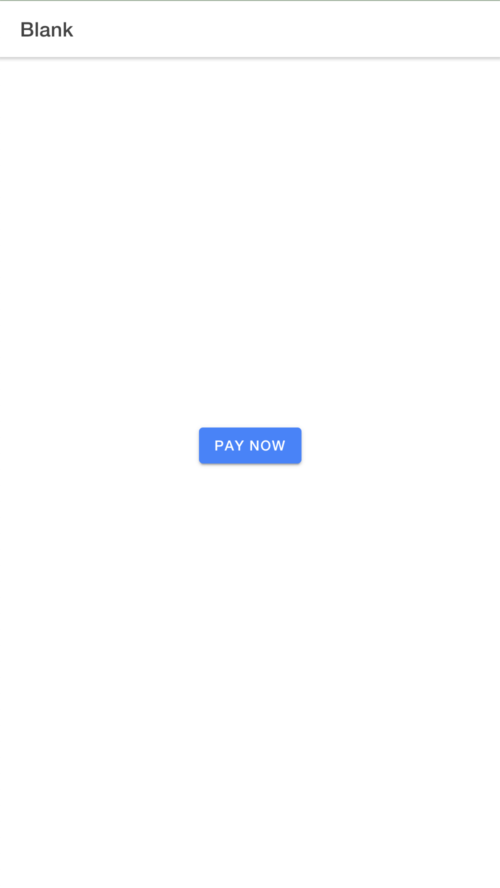

## ONLYPASS PAYMENT SDK
### Screenshots


### INSTALLATION
```
npm i onlypass-sdk;
```
### USAGE
```
import OnlyPass from 'onlypass-sdk';
```
- **onlypas api key** - This can be gotten from Onlypass dashboard setting section
- **Platform ID** - This can be gotten from Onlypass dashboard setting section
- **isDemo** - default is true
```
OnlyPass("onlypas api key","Platform ID","form Id",isDemo,webhookUrl);


```
